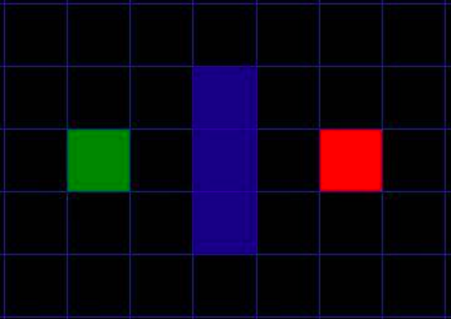
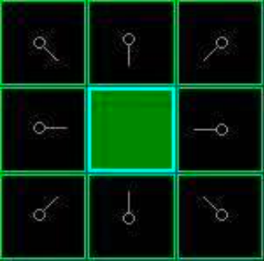
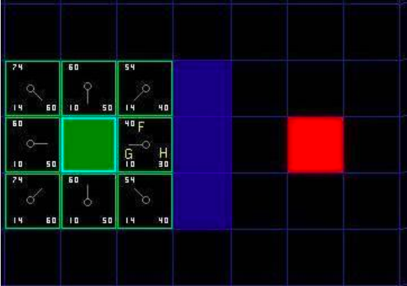

## A* Pathfinding

* First published in 1968
* Extension of Dijkstra's algorithm
* Developed to help improve Shakey the Robot's pathfinding performance

---

## Some Notes
* It uses heuristics to guide its search
* We're going to use two sets (the data structure) to keep a list of explored and unexplored nodes
* The term node and square is used interchangeably in this presentation

---

## Summary of steps
0. Divide up search space into nodes
1. Add starting node to the open list
2. Repeat the following
  * Look for the lowest F cost node on the open list (hear-by referred to as the current node)
  * Move it to the closed list
  * For each adjacent node to the current node
    * Ignore it if the node isn't walkable or on the closed list
    * If it's not on the open list, add it to the open list & make the current node the parent of this node.  Record the F,G, & H costs of the square (We'll talk more about this later)
    * If it's already on the open list, check to see if this path to that square is better, using g cost as a measure.  A lower G cost means that this is a better path.  If so, change the parent of this node to be the current node & recalculate the G & F scores of the square
  * Stop when you:
    * Add the target node to the closed list (found the path)
    * Fail to find the target square & the open list is empty (there is no path)
3. Save the path.  Working backwards from the target node we go from each node to its parent until we reach the starting node. (That's your path)

---

## Step 0: Divide Search Space Into Nodes

---

## Step 1: Add Starting Node to Our Open List

---

## Step 2: Conduct a Search to Find the Shortest Path
  * Start at Point A and check all of its adjacent nodes
  * Search outward until we find our target

---

## Step 2: Explained
* Begin with starting point A and add it to the 'open list' of nodes to be considered.
* Look at all walkable nodes adjacent to the starting point, ignoring illegal moves, and add them to the open list too.  Storing point A as their parent.
* Drop the starting node A from your open list to your closed list.

---

## Step 3: Determine the Node with the Lowest F Cost
* F = G + H
* Where G is the movement cost to move from starting point A to a given node, following the path generated to get there.
* Where H is the estimated movement cost to move from that node to the final destination, point B
---

## Step 3: Continued - Determining G
* We can calculate the G cost of a specific path to a node by taking the G cost of its parent and adding the cost it took to move in that direction.

**NOTE:**  In our example we're going to use a cost of 10 for horizontal moves & vertical moves and 14 for the diagonal.  The theory behind picking weights for horizontal, vertical, and diagonal movement is beyond the scope of this talk.

---

## Step 3: Continued - Estimating H
* One of the most common ways of estimating H is via the Manhattan Method.
* Called Manhattan Method because it's similar to the way you count city blocks in New York.  You only count horizontal and vertical because you can't cut diagonally across the block

* We calculate the total number of nodes moved horizontally and vertically to reach the target node from the current node, ignoring diagonal movement & obstacles in the way.  We then multiply that cost by our cost to move horizontally and vertically (10 in our example)
---

## Step 3: Continued - Determining F

* In the above diagram, in the square with the letters, G = 10 because its square is just one away from the starting square.  The squares orthogonal to the starting square also all have a G score of 10.  The diagonal squares all have G scores of 14.

* The H scores are determined by estimating the Manhattan distance between the given node and the red end square.  In the case of our lettered square it's 3(the number of nodes in the path) X 10(our horizontal movement cost)

* F is just G + H
